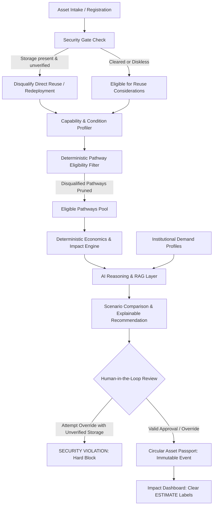
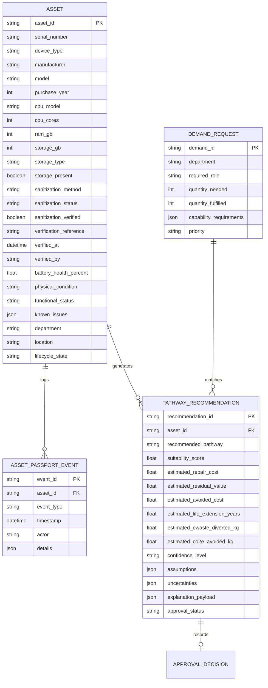

# ReLife: System Architecture & Technical Specification

## 1. Executive Architecture Overview

ReLife is an AI-assisted decision-support platform for orchestrating circular next-life pathways for enterprise and institutional IT hardware (initially laptops and desktops).

The system architecture enforces a strict **separation between deterministic rules and AI reasoning**:
- **Deterministic Layers**: Security sanitization enforcement, capability requirement matching, economic cost calculations, and formulaic environmental estimates.
- **AI Reasoning Layer**: Natural-language defect understanding, creative repurposing brainstorming, multi-factor trade-off ranking among eligible pathways, and explainability narratives.

---

## 2. Core Decision Pipeline

1. **Asset Intake & Registration**: Asset registered with device specs, physical condition grade, functional defects, and sanitization audit fields. Initial lifecycle state: `REGISTERED`.
2. **Security & Sanitization Gate (Deterministic & Non-Bypassable)**:
   - Evaluates: `storage_present`, `sanitization_method`, `sanitization_status`, `sanitization_verified`, `verification_reference`, `verified_at`, and `verified_by`.
   - If storage is present and `sanitization_verified == False`, **Direct Reuse / Redeployment / Resale / Donation** is strictly disqualified. **Human override can NEVER bypass this gate.**
3. **Capability Profiling**:
   - Maps raw hardware into multidimensional capability dimensions: `compute_tier` (ENTRY, MID, PERFORMANCE, LEGACY), `form_factor_mobility` (PORTABLE, DESK_BOUND), `graphics_capability`, `memory_capacity_gb`, `storage_speed_class`, `network_interfaces`, `os_compatibility`, `display_support`.
4. **Deterministic Pathway Eligibility Layer**:
   - Evaluates hard mechanical, electrical, and security constraints to determine which of the 6 canonical pathways are valid:
     1. Direct Reuse / Internal Redeployment
     2. Repair
     3. Refurbishment
     4. Repurposing
     5. Component Recovery
     6. Responsible Recycling
5. **Deterministic Economics & Environmental Estimations**:
   - **Economics**: Deterministic calculation of repair cost (parts + labor), residual depreciated value, avoided replacement cost, and threshold flags (e.g. `repair_cost > 0.5 * residual_value`).
   - **Environmental**: Versioned impact configuration (`impact_assumptions_v1.json`) maps device type to estimated embodied $\text{CO}_2\text{e}$, e-waste mass, and annual avoided carbon. All metrics explicitly labeled as **ESTIMATES**.
6. **AI Reasoning, Ranking & Explainability (LLM & RAG)**:
   - Takes only the **eligible pathways** and calculated numbers.
   - Evaluates context, active demand requirements, and suggests creative repurposing ideas.
   - Outputs: Recommended pathway, trade-off analysis, alternatives considered, confidence score, explicit assumptions, and a transparent **"Why this recommendation?"** section.
7. **Human Approval Gate & Override Validation**:
   - Technician reviews recommendation. May approve, reject, or select an alternate pathway.
   - Override is checked against the Security Gate: if user tries to redeploy an unverified machine, the action is rejected programmatically.
8. **Circular Asset Passport**:
   - Appends an immutable audit event (`event_type`, `timestamp`, `actor`, `details`) to the asset history.
   - Advances lifecycle state (`IN_REPAIR`, `IN_REDEPLOYMENT`, `IN_REPURPOSE`, etc.).

---

## 3. Data Models & Entity Relationships

---

## 4. API Boundaries (REST)

- `POST /api/v1/assets`: Register asset into inventory (`lifecycle_state = REGISTERED`).
- `GET /api/v1/assets/{asset_id}`: Retrieve asset profile + Circular Asset Passport audit history.
- `POST /api/v1/assets/{asset_id}/sanitization`: Log sanitization details and verification.
- `POST /api/v1/assets/{asset_id}/evaluate`: Execute end-to-end assessment (Security Gate $\rightarrow$ Eligibility $\rightarrow$ Economics $\rightarrow$ AI Ranking & Explanation).
- `POST /api/v1/approvals/{recommendation_id}/decide`: Submit human decision. Programmatically enforces that security gates cannot be bypassed.
- `GET /api/v1/impact/summary`: Aggregate estimated carbon, e-waste, and cost avoidance metrics.
