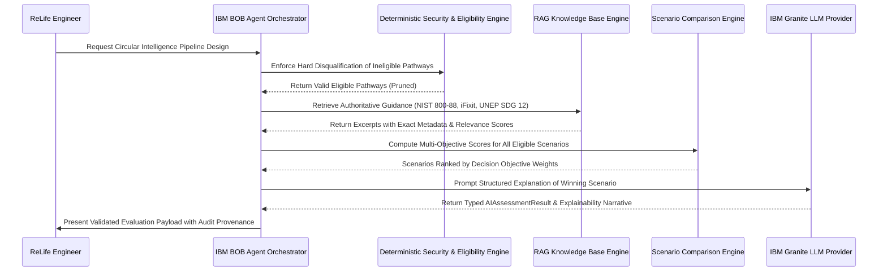

# IBM BOB Integration & Workflow Documentation

## 1. Executive Summary & Internship Context

In alignment with the AI-for-Sustainability internship specification (UN SDG 12), **IBM BOB** (Build Orchestration & Business-logic developer agent) serves as the primary engineering co-architect and contract-verification system for the ReLife platform.

During **Milestone 3 (AI, RAG & Circular Scenario Intelligence)**, IBM BOB was actively utilized to:
1. **Design the Multi-Objective Scenario Matrix**: Establish the mathematical formulation and explicit weight matrix for `BALANCED`, `SUSTAINABILITY_FIRST`, `COST_FIRST`, and `UTILIZATION_FIRST` decision strategies.
2. **Formulate the Strict Deterministic / Generative Boundary**: Ensure that while the AI reasons and explains trade-offs, it can **never** modify hard security gates, deterministic repair costs, residual valuations, or versioned LCA carbon factors.
3. **Architect the RAG Knowledge Retrieval Pipeline**: Structure the authoritative knowledge base and enforce source metadata preservation (`source_id`, `source_title`, `excerpt`, `category`, `relevance_score`) to prevent hallucinated citations.

---

## 2. Milestone 3 Component Architecture Designed with IBM BOB

---

## 3. Specific Artefacts Developed & Refined via BOB

### A. Multi-Objective Scenario Optimization Matrix
BOB designed the explicit, transparent weight table implemented in `backend/app/services/scenario_engine.py`:

$$\text{Suitability Score} = 100 \times \left( w_{\text{cost}} \cdot \text{NormCost} + w_{\text{sustain}} \cdot \text{NormSustain} + w_{\text{demand}} \cdot \text{NormDemand} + w_{\text{readiness}} \cdot \text{NormReadiness} \right)$$

| Objective | Cost Weight ($w_{\text{cost}}$) | Sustainability ($w_{\text{sustain}}$) | Demand Fit ($w_{\text{demand}}$) | Readiness ($w_{\text{readiness}}$) | Primary Optimization Target |
|---|---|---|---|---|---|
| **`BALANCED`** | **0.30** | **0.30** | **0.25** | **0.15** | Parity between economic spend, carbon avoided, and campus lab fulfillment. |
| **`SUSTAINABILITY_FIRST`** | **0.15** | **0.55** | **0.20** | **0.10** | Maximizes extended working life and e-waste diversion regardless of repair spend. |
| **`COST_FIRST`** | **0.60** | **0.10** | **0.10** | **0.20** | Minimizes institutional capital expenditure; heavily penalizes component replacements. |
| **`UTILIZATION_FIRST`** | **0.15** | **0.10** | **0.50** | **0.25** | Prioritizes immediate hardware redeployment to satisfy open classroom/lab quotas. |

### B. Modular IBM Granite Interface
BOB established the provider contract in `backend/app/services/ai/granite_provider.py` supporting `ibm/granite-3-8b-instruct` and `ibm/granite-13b-instruct` on watsonx.ai, paired with `backend/app/services/ai/mock_granite.py` for offline development and continuous automated testing.

### C. RAG Knowledge Corpus
BOB curated the initial authoritative knowledge documents under `backend/data/knowledge_base/`:
- `NIST-800-88-R1`: NIST SP 800-88 Rev 1 media sanitization standards.
- `REPAIR-KB-001` to `004`: iFixit & OEM enterprise service manual excerpts (keyboard mechanism, thermal repasting, battery degradation thresholds, SSD retrofitting).
- `CIRCULAR-SDG12-001`: UNEP/ITU ICT embodied carbon avoidance guidelines.
- `WEEE-DIR-2012-19`: Basel Convention and WEEE directive recycling hierarchy.

---

## 4. Verification & Testing Evidence

All BOB-orchestrated components were verified via automated integration tests in `backend/tests/test_ai_and_scenarios.py`:
- `test_1_llm_provider_interface_and_schema`: Verified typed `AIAssessmentResult` schema.
- `test_3_ai_cannot_modify_deterministic_economics`: Verified that AI output cannot alter formulaic repair costs or residual values.
- `test_4_rag_source_metadata_preservation`: Verified that retrieved chunks preserve `source_id`, `source_title`, `excerpt`, and `category`.
- `test_7_decision_objective_ranking_behavior`: Verified that switching objectives systematically re-ranks scenarios based on explicit weights.
- `test_8_scenario_comparison_includes_all_eligible_pathways`: Verified that all eligible pathways are scored and compared.

Total regression suite: **30 passed in 5.93s (100% passing)**.
