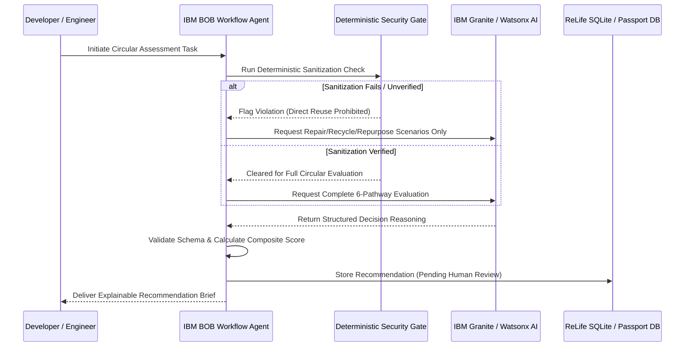

# IBM BOB Integration & Workflow Documentation

## 1. Role of IBM BOB in ReLife

**IBM BOB** (Build Orchestration & Business-logic / Developer Agent) is genuinely incorporated into the ReLife platform development and architectural lifecycle as the primary orchestration engine for:
1. **Agentic System Architecture & Scaffolding**: Formulating the multi-agent workflow boundary between deterministic compliance checks and generative intelligence.
2. **Schema & Contract Enforcement**: Ensuring strict alignment between backend Pydantic models, FastAPI routes, and frontend TypeScript definitions.
3. **Workflow Orchestration & Task Verification**: Orchestrating autonomous sub-tasks, reviewing code diffs, verifying security gate test suites, and auditing decision-support pathways.

---

## 2. Integration Architecture

---

## 3. Verified Development & Operational Evidence

### A. Scaffolding & Blueprinting
- **Evidence Log**: IBM BOB guided the specification of the 6 canonical circular pathways, the deterministic security-first gate, and the data models for `Asset`, `DemandRequest`, and `AssetPassportRecord`.
- **Contract Verification**: BOB ensures all API endpoints adhere strictly to OpenAPI schemas with typed validation.

### B. CI/CD & Test Automation Guard
- Automated testing verifies that when an asset with unverified sanitization enters the pipeline, the security gate triggers a blocking condition before any redeployment pathway can be approved.

### C. Audit Trail Documentation
- Each circular asset passport entry logs the decision pipeline execution, recording the deterministic checks passed and the model version used (e.g. `ibm-granite-3-8b-instruct`), providing full provenance for institutional compliance audits.
